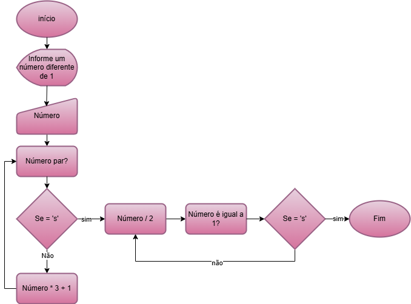

# Collatz

Recebeu este nome em referência ao matemático alemão Lathar Collatz. A conjectura de Collatz, ou problema, é um enigma matemático simples: paraqualquer inteiro positivo, se par, divida por 2; se ímpar, multiplique por 3 e some 1. A conjectura afirma que, repetindo o processo, todos os números chegam ao ciclo que é 1.
- Apesar de testada até números altíssimos, nunca foi aprovada.

## Tecnologias
- Linguagem C
- DevC++
- Fluxograma


## Como testar
- Clone o repositório
- Abra o arquivo .c com DevC++
- Pressione F11 para para compilar e executar


```c
#include <stdio.h>
#include <windows.h>
void main(){
	SetConsoleOutputCP(CP_UTF8);
	int n, op = 0;
	printf("Informe um número inteiro diferente de 1.\n");
	scanf("%d", &n);
	
	while(n != 1){
		if (n % 2 == 0){
			printf("%d / 2 =\n", n);
			n = n / 2;
			op++;
		}else{
			printf("%d * 3 + 1 =\n", n);
			n = n * 3 + 1;
			op++;
		}
	}
	printf("Seu número deu 1! Foram necessárias %d operações para chegar neste resultado.", op);
}
